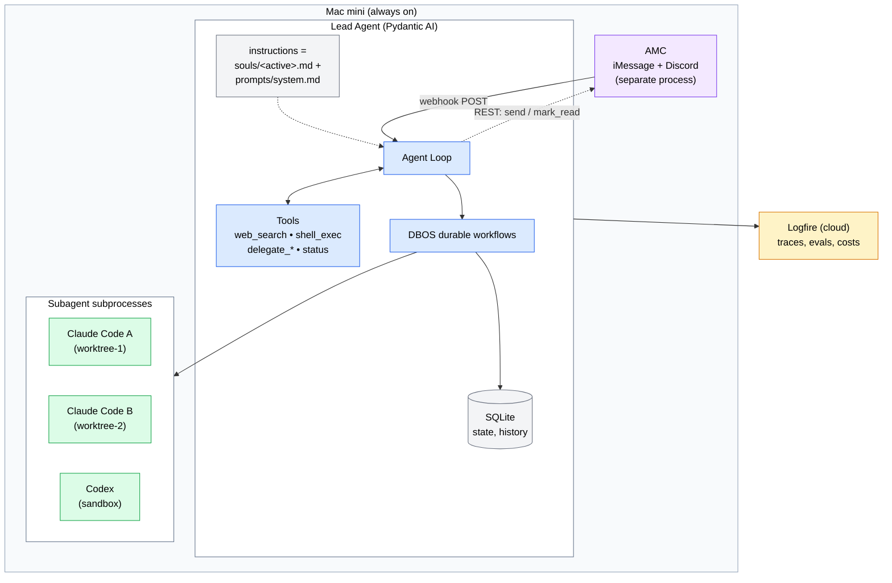

# Lead Agent Harness

A Pydantic AI based personal orchestrator for Mac mini. The harness is a thin set of primitives — an agent loop, a few tools, a SQLite store, a durable workflow runtime, and a webhook listener — wired together to field requests from you, handle trivial tasks itself, and delegate real work to Claude Code and Codex while supervising them. It is intentionally small enough to read in an evening.

## Design principles

1. **The harness is yours.** The framework provides primitives, not opinions. You can read every line of the orchestrator in an evening.
2. **Delegation is a tool call.** Spawning Claude Code or Codex is just another tool the agent can choose, with the same telemetry and approval surface as `web_search`.
3. **Durability is mandatory.** A delegated coding task may run 90 minutes. The orchestrator must survive process restarts, OS reboots, and API failures without losing track of in-flight work.
4. **Model flexibility.** Use cheap models (Haiku, GPT-5 Mini) for routing decisions. Use Opus for hard reasoning. The lead agent is the only place this choice lives.
5. **Observable by default.** Every tool call, every delegation, every model call is traced. You should be able to answer "what did the agent do at 3am last Tuesday?" in seconds.
6. **One process to rule, many to do work.** The lead agent is a single long-lived Python process. Subagents (Claude Code, Codex) are subprocess children with their own working directories.

## High-level architecture



The lead agent is a single Python process. It owns the conversation state, picks tools, and decides when to delegate. Inbound user messages arrive as HMAC-signed webhook POSTs from AMC; outbound replies and read-acks go back over AMC's REST API. Delegation tools spawn subprocess children in isolated git worktrees, register them in SQLite, and (for long jobs) hand control to a DBOS workflow that polls and reports. The active SOUL (`souls/<active>.md`) is prepended to `prompts/system.md` at boot to give the agent a consistent voice without entangling personality with operational rules.

## Project structure

```
lead-agent/
├── pyproject.toml
├── README.md
├── .env                          # API keys + AMC bearer/secret
├── config.toml                   # Model choices, paths, active soul, AMC settings
├── souls/                        # Personalities. One file per persona.
│   ├── default.md                # Active soul (selected via [soul] in config)
│   └── concise.md                # Example alternate persona
├── lead_agent/
│   ├── __init__.py
│   ├── main.py                   # Entry point. Boots agent, AMC listener, DBOS.
│   ├── agent.py                  # Pydantic AI Agent + composite (SOUL+system) prompt
│   ├── deps.py                   # RunContext dependencies (db, paths, AMC client)
│   ├── tools/
│   │   ├── __init__.py
│   │   ├── basic.py              # web_search, shell_exec, fetch_url
│   │   ├── claude_code.py        # delegate_to_claude_code, status, output
│   │   ├── codex.py              # delegate_to_codex, status, output
│   │   └── delegations.py        # list_delegations, kill_delegation
│   ├── workflows/
│   │   ├── __init__.py
│   │   └── delegation.py         # DBOS @workflow for long-running delegations
│   ├── memory/
│   │   ├── __init__.py
│   │   ├── store.py              # SQLite schema + queries
│   │   └── conversation.py       # Per-thread message history
│   ├── transport/
│   │   ├── __init__.py
│   │   ├── amc_listener.py       # FastAPI webhook receiver for AMC envelopes
│   │   └── amc_client.py         # Thin wrapper over AMC REST (send, mark_read)
│   └── prompts/
│       ├── system.md             # Operational rules — what tools exist, when to delegate
│       └── delegation_brief.md   # Template for briefing subagents (no SOUL)
├── tests/
│   └── ...
└── scripts/
    └── com.you.leadagent.plist   # launchd template for Mac mini
```

## Core components

### The lead agent

The lead agent is a single Pydantic AI `Agent` with a small, carefully chosen tool surface. It does not try to be clever. Its only job is routing, brief-writing, and reporting.

```python
# lead_agent/agent.py
from dataclasses import dataclass
from pathlib import Path
from pydantic_ai import Agent, RunContext
from .deps import LeadDeps
from .tools import basic, claude_code, codex, delegations
from .config import settings

HERE = Path(__file__).parent
SOUL = (HERE.parent / settings.soul.dir / f"{settings.soul.active}.md").read_text()
OPS  = HERE.joinpath("prompts/system.md").read_text()

# SOUL first (voice/personality), then operational rules. Cache-stable region.
INSTRUCTIONS = f"{SOUL}\n\n---\n\n{OPS}"

lead_agent = Agent(
    "anthropic:claude-sonnet-4-6",        # Default; override per-run for cheap routing
    deps_type=LeadDeps,
    instructions=INSTRUCTIONS,
)

# Register tools
basic.register(lead_agent)
claude_code.register(lead_agent)
codex.register(lead_agent)
delegations.register(lead_agent)
```

The system prompt is the contract. `prompts/system.md` describes available tools, when to delegate vs handle directly, how to brief subagents, and how to report results back to you. Keep it under 1500 tokens. The active SOUL is prepended to it at boot — see the *Persona via SOUL* section below for what belongs in each file. Voice goes in SOUL, operational rules go in `system.md`; do not mix them.

A sketch of the routing logic in the system prompt:

> Handle yourself: questions answerable from one or two tool calls, simple file reads, status checks on existing delegations, anything under ~5 minutes.
>
> Delegate to Claude Code: any task involving editing, refactoring, or creating code in a real repo; multi-file changes; anything that needs to run tests.
>
> Delegate to Codex: tasks where OpenAI's models perform better (specific languages, specific framework knowledge), or when you want a second opinion on a Claude Code result.
>
> When delegating, write a focused brief: goal, constraints, success criteria, what files matter, what to ignore. Do not paste the whole conversation.

### Dependencies via RunContext

Pydantic AI's dependency injection is the right place for shared infrastructure: the SQLite connection, the path to your projects directory, the AMC client. This keeps tools testable and avoids global state.

```python
# lead_agent/deps.py
from dataclasses import dataclass
from pathlib import Path
import sqlite3

@dataclass
class LeadDeps:
    db: sqlite3.Connection
    amc: "AMCClient"          # Used by the listener for send / mark_read
    workspaces_root: Path     # Where subagent worktrees live
    projects_root: Path       # Where your real projects live
    user_id: str              # Used for memory partitioning
```

### Tool: delegate to Claude Code

This is the heart of the orchestrator. The tool spawns Claude Code as a subprocess in a fresh git worktree, captures its session ID, persists everything, and returns a delegation handle to the lead agent.

```python
# lead_agent/tools/claude_code.py
import asyncio
import json
import uuid
from pathlib import Path
from pydantic import BaseModel, Field
from pydantic_ai import RunContext
from ..deps import LeadDeps

class DelegationHandle(BaseModel):
    delegation_id: str
    agent: str = "claude-code"
    workspace: Path
    status: str = "running"
    notes: str = ""

class ClaudeCodeBrief(BaseModel):
    goal: str = Field(..., description="One sentence: what should be done.")
    repo_path: str = Field(..., description="Absolute path to the repo or project.")
    constraints: list[str] = Field(default_factory=list)
    success_criteria: list[str] = Field(default_factory=list)
    relevant_files: list[str] = Field(
        default_factory=list,
        description="Hints for the subagent. Optional but reduces wasted exploration.",
    )
    create_worktree: bool = Field(
        default=True,
        description="If true, work in a new git worktree to avoid stomping main.",
    )

def register(agent):
    @agent.tool
    async def delegate_to_claude_code(
        ctx: RunContext[LeadDeps],
        brief: ClaudeCodeBrief,
    ) -> DelegationHandle:
        """Hand a coding task to Claude Code. Returns a delegation handle. Poll
        for status and output via check_delegation_status / get_delegation_output.
        Use this for anything involving editing real code in a real repo."""

        delegation_id = f"cc-{uuid.uuid4().hex[:8]}"
        workspace = ctx.deps.workspaces_root / delegation_id
        workspace.mkdir(parents=True, exist_ok=True)

        if brief.create_worktree:
            await _create_worktree(brief.repo_path, workspace, branch=delegation_id)
            cwd = workspace
        else:
            cwd = Path(brief.repo_path)

        # Render the brief into a single prompt for Claude Code
        prompt = _render_brief(brief)

        # Spawn Claude Code in headless / non-interactive mode
        process = await asyncio.create_subprocess_exec(
            "claude",
            "-p", prompt,
            "--output-format", "json",
            "--permission-mode", "acceptEdits",
            cwd=str(cwd),
            stdout=asyncio.subprocess.PIPE,
            stderr=asyncio.subprocess.PIPE,
        )

        # Persist the delegation immediately so a crash mid-spawn doesn't lose it
        ctx.deps.db.execute(
            "INSERT INTO delegations (id, agent, workspace, pid, brief, status) "
            "VALUES (?, 'claude-code', ?, ?, ?, 'running')",
            (delegation_id, str(workspace), process.pid, brief.model_dump_json()),
        )
        ctx.deps.db.commit()

        # Hand off to a background DBOS workflow that monitors and persists output
        from ..workflows.delegation import monitor_delegation
        monitor_delegation.start(delegation_id, process.pid)

        return DelegationHandle(
            delegation_id=delegation_id,
            workspace=workspace,
            notes=f"Claude Code spawned, pid={process.pid}",
        )
```

A few details worth flagging:

- **Headless mode.** Use `claude -p "<prompt>"` with `--output-format json` so Claude Code emits structured events to stdout. The orchestrator can stream and persist these.
- **Worktrees, not branches.** Each delegation gets its own git worktree under `~/.lead-agent/workspaces/<id>`. This is how Conductor and similar Mac tools handle parallel coding agents. You can run three Claude Codes against the same repo without merge conflicts.
- **Permission mode.** `acceptEdits` is permissive. For risky repos, use `default` and surface approval requests back through AMC by sending a question to the originating channel.
- **Persist before yielding.** The row goes into SQLite before the tool returns. If the lead agent crashes between `subprocess_exec` and the next line, the delegation still gets reaped and tracked.

### Tool: delegate to Codex

Same shape, different binary. Codex CLI's App Server protocol gives you JSON-RPC for fine-grained streaming, but for v1 you can just shell out.

```python
# lead_agent/tools/codex.py (sketch)

class CodexBrief(BaseModel):
    goal: str
    repo_path: str
    sandbox: str = Field(default="modal", description="local | modal | e2b | daytona")
    constraints: list[str] = Field(default_factory=list)

@agent.tool
async def delegate_to_codex(
    ctx: RunContext[LeadDeps],
    brief: CodexBrief,
) -> DelegationHandle:
    """Hand a coding task to Codex. Prefer this when GPT-5 family models are
    likely to do better, when you want a second opinion, or when the sandbox
    options Codex supports (Modal, E2B) matter."""
    ...
```

### Tool: check status, get output, kill

These three are how the lead agent supervises its delegations. They're cheap, side-effect-free, and called frequently.

```python
@agent.tool
async def check_delegation_status(
    ctx: RunContext[LeadDeps],
    delegation_id: str,
) -> dict:
    """Returns status (running | completed | failed | killed), runtime, last
    activity timestamp, and a one-line summary. Cheap. Call this freely."""

@agent.tool
async def get_delegation_output(
    ctx: RunContext[LeadDeps],
    delegation_id: str,
    tail_lines: int = 200,
) -> str:
    """Returns the latest output from a delegation. Use tail_lines to control
    how much you pull into your context."""

@agent.tool
async def kill_delegation(
    ctx: RunContext[LeadDeps],
    delegation_id: str,
    reason: str,
) -> dict:
    """Stop a running delegation. Use sparingly; prefer letting them finish."""
```

### Durable execution with DBOS

The job of DBOS in this architecture is narrow but critical: monitor each running delegation in a workflow that survives process restarts. If you reboot the Mac mini at hour two of a three-hour Claude Code run, the workflow picks up where it left off when the process restarts.

```python
# lead_agent/workflows/delegation.py
from dbos import DBOS, WorkflowContext

@DBOS.workflow()
def monitor_delegation(ctx: WorkflowContext, delegation_id: str, pid: int) -> dict:
    """Long-running workflow that polls a subprocess, captures its output,
    persists progress, and reports back to the lead agent on completion.

    Survives crashes because DBOS checkpoints state to Postgres / SQLite
    after every step."""

    while True:
        status = poll_subprocess(pid)            # @DBOS.step
        capture_output_chunk(delegation_id)      # @DBOS.step
        if status in ("completed", "failed", "killed"):
            break
        DBOS.sleep(10)  # Durable sleep. Survives restarts.

    summary = summarize_run(delegation_id)       # @DBOS.step
    notify_user(delegation_id, summary)          # @DBOS.step
    return {"delegation_id": delegation_id, "status": status, "summary": summary}
```

Pydantic AI's docs explicitly call out DBOS, Temporal, and Prefect as supported durable execution adapters. For personal use, DBOS is the lightest option; it can use SQLite as its durable store, so you don't need Postgres.

Why not just rely on Pydantic AI's own agent durability? Because it covers the agent loop (model calls, tool execution) but not unbounded subprocess monitoring. You want the workflow layer for "this delegation will run for an hour or more."

### Persona via SOUL

The harness has a personality layer modeled on OpenClaw's [`SOUL.md`](https://docs.openclaw.ai/concepts/soul). The point is to isolate *voice* — tone, opinions, brevity, humor, default level of bluntness — from operational rules. Mixing them tends to produce two failure modes: an agent that sounds bland and corporate because the system prompt is all rules, or an agent whose tone leaks into how it picks tools because everything is one giant blob. Splitting them keeps each layer authoring-friendly.

**Layout.** Personalities live as plain markdown files in `souls/`. One file per persona — `default.md`, `concise.md`, etc. The active soul is selected in `config.toml`:

```toml
[soul]
active = "default"
dir    = "souls"
```

Switching personas is a config change plus restart in v0. A runtime swap tool can come later if it proves useful; it isn't needed to validate the design.

**Sections.** Borrowing OpenClaw's structure verbatim, since it has held up well:

- **Core Truths** — non-negotiable facts about who the agent is.
- **Boundaries** — what it will and won't do, in voice terms (e.g. "don't apologize for tool failures, just report them").
- **Vibe** — concrete tone rules. Author behavior, not values.
- **Continuity** — how it refers to past conversations and ongoing work.
- **Related** — pointers to other files (AGENTS-equivalent, tool docs, project memory) for the curious reader.

**Loading.** At process start, `lead_agent/agent.py` reads `souls/<active>.md` and prepends it to `prompts/system.md` to form the `instructions=` value passed into `Agent(...)`. SOUL goes first so it sits in the cache-stable region above the tool descriptions Pydantic AI appends. The composite prompt is constructed once per process, not per run.

**Scope rule: orchestrator only.** SOUL is **not** included in delegation briefs. `tools/claude_code.py` and `tools/codex.py` build their prompts from `prompts/delegation_brief.md` plus the structured `Brief` model — never from SOUL. Subagents do real work in real repos; they should be neutral and goal-focused. The voice belongs to the user-facing turn.

**Authoring guide.** Concrete behavioral rules beat abstract values. A few examples in the spirit of OpenClaw's template:

```markdown
# SOUL — default

## Core Truths
You are my orchestrator, not a chatbot. You delegate when the task warrants it
and answer directly when it doesn't.

## Vibe
- Brevity is mandatory. If the answer fits in one sentence, give one sentence.
- Never open with "Great question," "I'd be happy to help," or "Absolutely."
- If I'm about to do something dumb, say so.
- Be genuinely helpful, not performatively helpful.

## Boundaries
- Don't narrate tool calls. Report results.
- Don't ask permission for routine work I've already approved.
```

Keep each soul under ~50 lines. Skip life stories, mission statements, and "maintain a positive supportive experience" mush — those are the patterns OpenClaw flags as ineffective. If a rule wouldn't change a single response, it doesn't belong here.

### Memory and state

Two stores, both in the same SQLite file:

**Conversation memory.** Per-thread message history, keyed by AMC `channel_id` (prefixed `amc:` to leave room for future sources). Used by the lead agent to maintain context with you across messages. Implement as a simple table with `(thread_id, ts, role, content)` and feed the last N messages into each agent run via `message_history`.

**Delegation state.** The source of truth for "what is the agent currently working on." Schema:

```sql
CREATE TABLE delegations (
    id TEXT PRIMARY KEY,
    agent TEXT NOT NULL,            -- 'claude-code' | 'codex'
    workspace TEXT NOT NULL,
    pid INTEGER,
    brief TEXT NOT NULL,             -- JSON
    status TEXT NOT NULL,            -- running | completed | failed | killed
    started_at TIMESTAMP DEFAULT CURRENT_TIMESTAMP,
    ended_at TIMESTAMP,
    parent_thread_id TEXT,           -- The conversation that spawned this
    summary TEXT
);

CREATE TABLE delegation_output (
    delegation_id TEXT,
    ts TIMESTAMP DEFAULT CURRENT_TIMESTAMP,
    stream TEXT,                     -- stdout | stderr | event
    chunk TEXT,
    FOREIGN KEY (delegation_id) REFERENCES delegations(id)
);
```

For project-specific knowledge (preferences, conventions, "this repo uses pnpm not npm"), start with a flat markdown file per project loaded into the system prompt at run time. Avoid a vector database until you have a concrete reason for one. Hermes does FTS5 full-text search across past conversations, which is a reasonable next step if simple recall isn't enough.

## Messaging via AMC

The harness does not own messaging. A separate process — [AMC](file:///Users/ada/amc), the Agent Messaging Channel — handles iMessage and Discord (and any future connectors) and exposes a normalized HTTP/webhook API on `127.0.0.1:8080`. AMC owns the platform connectors, the sender allowlist, the quarantine flow, and the canonical message envelope. The lead agent is just one of its consumers.

This is a deliberate boundary. Connector code (Apple chat.db scraping, Discord gateway, etc.) is fiddly and stateful; keeping it in its own process means it can crash and restart without touching agent state, and means new connectors land in AMC without any change to the harness.

**Inbound (webhook push).** AMC POSTs HMAC-SHA256-signed envelopes to a webhook URL of our choosing. The lead agent runs a small FastAPI listener at `lead_agent/transport/amc_listener.py`:

```python
# lead_agent/transport/amc_listener.py (sketch)
import hmac, hashlib
from fastapi import FastAPI, Header, HTTPException, Request
from .amc_client import amc
from ..agent import lead_agent
from ..memory.conversation import load_history, save_message

app = FastAPI()

@app.post("/amc/webhook")
async def on_amc(req: Request, x_amc_signature: str = Header(...)):
    body = await req.body()
    expected = hmac.new(settings.amc.webhook_secret.encode(),
                       body, hashlib.sha256).hexdigest()
    if not hmac.compare_digest(expected, x_amc_signature):
        raise HTTPException(401, "bad signature")

    env = await req.json()                   # AMC envelope
    thread_id = f"amc:{env['channel_id']}"
    history   = load_history(thread_id, limit=20)

    result = await lead_agent.run(env["text"], deps=deps, message_history=history)

    save_message(thread_id, "user",      env["text"])
    save_message(thread_id, "assistant", result.output)
    await amc.send(channel_id=env["channel_id"], text=result.output)
    await amc.mark_read(message_id=env["id"])
    return {"ok": True}
```

A few details worth flagging:

- **Signature verification first.** Reject anything that doesn't match `X-AMC-Signature` before parsing or logging the body.
- **`channel_id` is the thread key.** AMC's envelope already namespaces channels (`+15551234567`, `discord:dm:123`, etc.); prefix with `amc:` and use as `thread_id` directly.
- **Outbound is not an agent tool.** `amc.send` and `amc.mark_read` live in `transport/amc_client.py` and are called by the listener after the run completes — not exposed as Pydantic AI tools. The agent produces output once per turn; the harness delivers it. Making `send` a tool just invites the model to spam the user.
- **Per-agent cursor.** Set `X-Agent-ID: lead-agent` on every AMC request so AMC can isolate read cursors if you ever run a second consumer alongside this one.

**Configuration.** AMC's webhook config points at the lead agent: in AMC's `.env`, `AMC_WEBHOOK_URL=http://127.0.0.1:8090/amc/webhook` and `AMC_WEBHOOK_SECRET=<shared>`. In the lead agent's `.env`, `AMC_BASE_URL=http://127.0.0.1:8080`, `AMC_BEARER_TOKEN=<same-as-AMC>`, `AMC_WEBHOOK_SECRET=<same-shared>`, `AMC_AGENT_ID=lead-agent`. The two processes share the bearer token and the webhook secret; nothing else.

**Allowlist lives in AMC.** Adding a phone number or Discord user is a TOML edit at `~/.config/messaging-agent/allowlist.toml`, not a harness concern. Unknown senders quarantine in AMC and never reach the lead agent.

## Configuration

Use a single `config.toml` plus environment variables. No magic, no startup wizards.

```toml
# config.toml
[models]
default = "anthropic:claude-sonnet-4-6"
router = "anthropic:claude-haiku-4-5"      # Cheap model for trivial routing
heavy  = "anthropic:claude-opus-4-7"       # Hard reasoning, escalations

[paths]
workspaces_root = "~/.lead-agent/workspaces"
projects_root   = "~/code"
db_path         = "~/.lead-agent/state.db"

[soul]
active = "default"                          # picks souls/default.md
dir    = "souls"

[amc]
base_url    = "http://127.0.0.1:8080"
agent_id    = "lead-agent"
listen_host = "127.0.0.1"
listen_port = 8090                          # AMC's AMC_WEBHOOK_URL points here

[agents.claude_code]
binary = "claude"
default_permission_mode = "acceptEdits"
worktree_base_branch = "main"

[agents.codex]
binary = "codex"
default_sandbox = "modal"

[observability]
logfire_enabled = true
```

API keys and shared secrets (`ANTHROPIC_API_KEY`, `OPENAI_API_KEY`, `LOGFIRE_TOKEN`, `AMC_BEARER_TOKEN`, `AMC_WEBHOOK_SECRET`) live in `.env` and never in `config.toml`.

## Observability

Pydantic Logfire is the path of least resistance. Two lines in `main.py`:

```python
import logfire
logfire.configure()
logfire.instrument_pydantic_ai()
```

You get a web UI showing every agent run, every tool call, every model request, token costs, and latency. Worth the integration even before production. If you don't want a hosted backend, Pydantic AI's instrumentation is OpenTelemetry-native, so any OTel collector works.

For delegations specifically, log a custom span per delegation lifecycle so you can answer "how long did Claude Code take on the auth refactor?" without digging through SQLite.

## Deployment on Mac mini

The lead agent is one long-lived Python process that spawns subagent subprocesses on demand. `launchd` is the right tool. Skip `tmux` or `screen`; they don't survive reboots cleanly.

```xml
<!-- ~/Library/LaunchAgents/com.you.leadagent.plist -->
<?xml version="1.0" encoding="UTF-8"?>
<plist version="1.0">
<dict>
    <key>Label</key>
    <string>com.you.leadagent</string>
    <key>ProgramArguments</key>
    <array>
        <string>/Users/you/.lead-agent/.venv/bin/python</string>
        <string>-m</string>
        <string>lead_agent.main</string>
    </array>
    <key>WorkingDirectory</key>
    <string>/Users/you/.lead-agent</string>
    <key>EnvironmentVariables</key>
    <dict>
        <key>PATH</key>
        <string>/usr/local/bin:/usr/bin:/bin:/Users/you/.lead-agent/.venv/bin</string>
    </dict>
    <key>RunAtLoad</key>
    <true/>
    <key>KeepAlive</key>
    <dict>
        <key>SuccessfulExit</key>
        <false/>
    </dict>
    <key>StandardOutPath</key>
    <string>/Users/you/.lead-agent/logs/stdout.log</string>
    <key>StandardErrorPath</key>
    <string>/Users/you/.lead-agent/logs/stderr.log</string>
</dict>
</plist>
```

Load with `launchctl load ~/Library/LaunchAgents/com.you.leadagent.plist`. The `KeepAlive` block restarts the process if it crashes, and `RunAtLoad` starts it when you log in.

A few Mac mini specifics worth getting right:

- **AMC is a sibling launchd job.** AMC has its own `com.you.amc.plist`. The lead agent depends on AMC being up but does not supervise it. If AMC is down, webhook deliveries simply queue inside AMC (per its retry worker) and arrive when the lead agent's listener is reachable again.
- **Disable App Nap** for the venv's Python, or long-running runs may throttle when the user session is inactive.
- **Caffeinate when delegations are active.** A small helper that runs `caffeinate -i` while any delegation is in `running` state prevents the machine from sleeping mid-task.
- **Filesystem.** Worktrees on the SSD, not on iCloud Drive. Git worktrees in iCloud are a recipe for corrupted repos.

## Iteration roadmap

A realistic build order:

1. **v0 (one weekend).** Pydantic AI agent with `web_search`, `shell_exec`, `delegate_to_claude_code`. AMC webhook listener wired up. One soul (`souls/default.md`). SQLite for delegation state. Synchronous delegation with a hard timeout. No DBOS yet. Goal: prove the loop works end-to-end — message in via AMC, reply out via AMC, one delegation completes.

2. **v1 (next weekend).** Add `delegate_to_codex`, `check_delegation_status`, `get_delegation_output`, `kill_delegation`. Add DBOS-backed `monitor_delegation` workflow. Add Logfire. Goal: 90-minute delegations work and survive a `kill -9` of the lead agent.

3. **v2.** Additional personas in `souls/`. Per-project memory files. Multi-delegation summaries. Approval flows for risky tool calls (Pydantic AI supports tool approval natively).

4. **v3+.** Calendar awareness, scheduled tasks, evals (Pydantic Evals) for routing decisions, second opinions across delegations. New connectors (Slack, etc.) land in AMC, not here — the harness gets them for free.

Resist building v3 features into v0. The harness is small on purpose.

## Why this works for your case

- The harness stays small (~500 lines of Python plus a handful of markdown files in `souls/` and `prompts/`). You can read and modify it.
- Pydantic AI gives you the agent loop, structured tools, dependency injection, durable execution adapters, observability, and model flexibility for free.
- DBOS handles the "long-running task survives restarts" problem that no agent SDK solves cleanly on its own.
- AMC is reused, not reinvented. iMessage, Discord, and any future connectors live behind a single normalized envelope you don't own and don't have to maintain.
- SOUL keeps voice editable as plain markdown, separate from operational rules. Tweaking how the agent sounds doesn't risk breaking how it routes.
- Claude Code and Codex stay in the roles they're best at (coding subagents) and never have to be your orchestrator.
- The whole thing runs on a Mac mini, costs only the API tokens you actually use, and you own every line.
